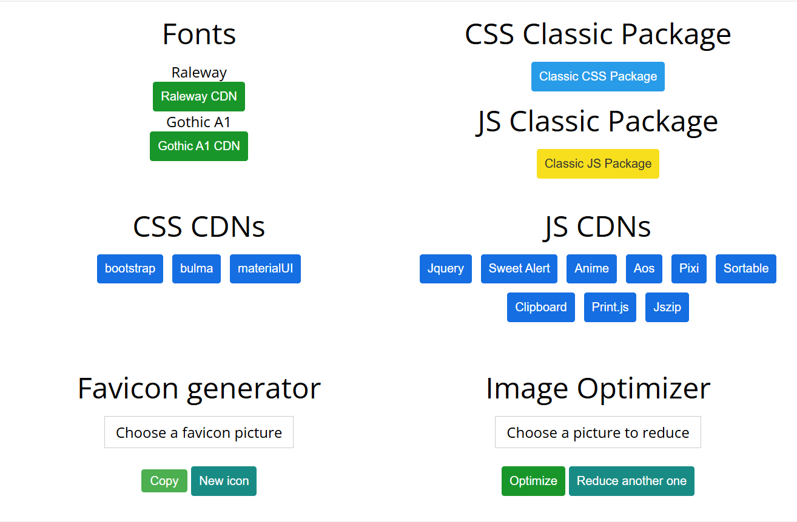
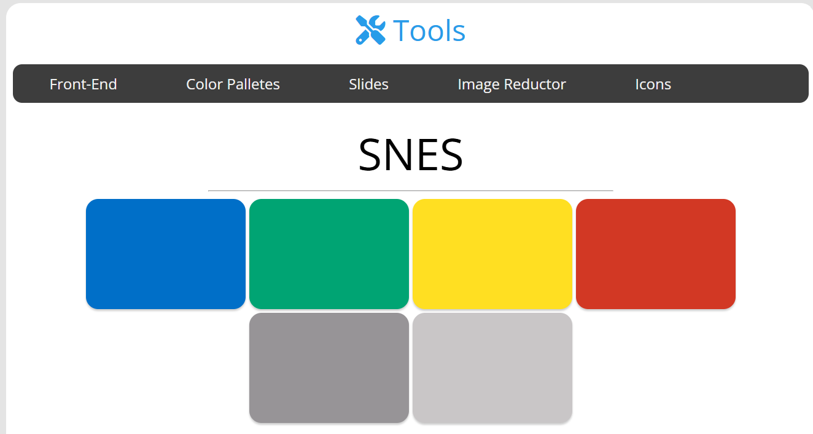

#  Herramientas para desarrollador

Projecto disponible en: [https://fcancinos.github.io/WebDeveloperTools/](https://fcancinos.github.io/WebDeveloperTools/)
## 1. Front-End
- fuentes, paquetes jquey y css de bootstrap, generador de favicons
## Descripción

Construye y maquete sitios web más facil sin visitar las paginas de todos los frameworks

## Características

- Copia el CDN de diferentes frameworks.(Bootstrap, SweatAlert, Clipboard).
- Optimiza imagenes sin perder la calidad.
- Copia los iconos de font-awesome.
- Genera los favicons necesarios y guarda en el portapapeles el código para insertarlo.

## 2. Galería de Paletas de Colores

## Descripción

Esta es una galería web que muestra varias paletas de colores. Los usuarios pueden hacer clic en los botones de cada paleta para copiar los colores correspondientes al portapapeles.

## Características

- Visualización de diferentes paletas de colores.
- Copia el color seleccionado al portapapeles al hacer clic en el botón.
- Mensaje de alerta que confirma la acción.

Projecto disponible en: [https://fcancinos.github.io/WebDeveloperTools/](https://fcancinos.github.io/WebDeveloperTools/)

### Más características pronto